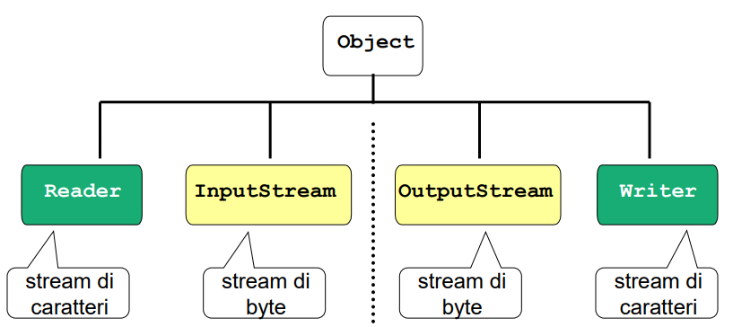

# I/O in Java: concetti base

- [I/O in Java: concetti base](#io-in-java-concetti-base)
  - [1. Introduzione](#1-introduzione)
  - [2. Rappresentare file e directory: File \& Path](#2-rappresentare-file-e-directory-file--path)
  - [3. `java.io`: le basi](#3-javaio-le-basi)
- [Stream di bytes](#stream-di-bytes)
  - [1. Input e output da file](#1-input-e-output-da-file)
  - [2. Adapter streams](#2-adapter-streams)
    - [Esempio: scrittura di dati su file](#esempio-scrittura-di-dati-su-file)
  - [3. Serializzazione di oggetti](#3-serializzazione-di-oggetti)
    - [Metodi per serializzare e deserializzare](#metodi-per-serializzare-e-deserializzare)
  - [4. La stream factory](#4-la-stream-factory)
- [Stream di testo](#stream-di-testo)
  - [1. Casi d'uso dell'input di testo](#1-casi-duso-dellinput-di-testo)
  - [2. Struttura, classi base e utilizzo](#2-struttura-classi-base-e-utilizzo)
    - [Utilizzo delle classi](#utilizzo-delle-classi)
  - [3. Adapter](#3-adapter)
- [Tokenizzazione](#tokenizzazione)
  - [1. Tokenizzazione di righe: introduzione](#1-tokenizzazione-di-righe-introduzione)
    - [Principio base di operatività](#principio-base-di-operatività)
      - [Esempio 1: separatore fisso ($)](#esempio-1-separatore-fisso-)
      - [Esempio 2: separatori diversi ma raggruppabili (, -)](#esempio-2-separatori-diversi-ma-raggruppabili---)
      - [Esempio 3: separatori diversi e non raggruppabili (, -)](#esempio-3-separatori-diversi-e-non-raggruppabili---)
      - [Esempio 4: separatori impliciti](#esempio-4-separatori-impliciti)
      - [Esempio 5: larghezza fissa](#esempio-5-larghezza-fissa)
  - [2. Scanner e split()](#2-scanner-e-split)
    - [La classe Scanner](#la-classe-scanner)


## 1. Introduzione
Java gestisce sin dalla sua nascita il trasferimento di dati in input e output tramite stream, canali unidirezionali che possono essere collegati a qualsiasi dispositivo e che alla base trasportano singoli bytes. Sugli stream di byte poi si appoggiano quelli di caratteri, realizzati perchè largamente utilizzati e quindi parecchio comodi. <br> I punti a favore di questa architettura sono proprio il fatto che il trasferimento può essere realizzato tra dispositivi di qualsiasi tipo (anche tramite rete) per via dell'assenza di necessità di avere informazioni sui soggetti. Inoltre in questo modo si ha anche la possibilità di creare canali più evoluti appoggiandosi su quelli esistenti tramite un pattern a cipolla. <br> L'unico punto a sfavore è la difficoltà di configurazione del sistema quando si vanno a creare applicazioni da console e non grafiche. Per questo le versioni successive, soprattutto Java25 con la classe IO e i suoi metodi print() e println(), si sono proposte di porre rimedio.

## 2. Rappresentare file e directory: File & Path

File è una entità di `java.io` che modella in Java il concetto di file e di directory. Il costruttore prende in argomento il nome del file o directory, che possono anche non esistere al momento della creazione, ma essere create successivamente. La classe offre metodi per operare su files e directory, nonchè per controllare l'esistenza degli stessi e i permessi in lettura, scrittura ed esecuzione. In alcune costanti poi sono memorizzati i separatori per file e percorsi:
```java
File.separator //separatore per un file nei path (\ in Windows, / in MacOS e Unix)

File.pathSeparator //separatore per path differenti (: in MacOS, Unix e nei JAR, ; in Windows)
```
A partire da Java 7 File è stata sostituita con Path. File infatti rappresentava un approccio al problema troppo basico e poco scalabile.<br> Path è un'interfaccia di `java.nio.file` che come File modella un percorso (file o directory) che può essere anche inesistente, fornendo metodi per operarci e recuperarne informazioni, risentendo dei separatori relativi al sistema. A differenza di File non ha costruttori interni, rimpiazzati dai metodi della factory *Paths*. I metodi toFile e toPath garantiscono l'interoperabilità tra il nuovo e il vecchio metodo.

Per costruire un Path il metodo principale è Paths.get(), che accetta sia una singola stringa che più parametri rappresentanti ognuno un pezzo del percorso.
```java
Path p1 = Paths.get("Documents\\text\\file.txt");
Path p1 = Paths.get("Documents", "text", "file.txt");

//Con tutta una serie di metodi si può poi operare sul path
p1.getFileName() -> file.txt
p1 -> Documents\text\file.txt
p1.getNameCount() -> il numero strati attraversati: 3
p1.getParent() -> il padre del file: text

e altri
```
Più Path possono essere **concatenati** con il metodo p1.resolve(p2). In questo caso il metodo fallisce se si provano a concatenare un percorso relativo e uno assoluto o similari. <br> Più Path possono essere anche **relativizzati** uno rispetto all'altro, tramite p1.relativize(p2) che crea il Path relativo che da p1 va a p2.

## 3. `java.io`: le basi

Come detto prima alla base dell'IO c'è lo stream di byte, canale monodirezionale capace di trasferire uno o più byte in sequenza. Oltre a quello poi è implementato anche lo stream di caratteri, ottimizzato per l'IO appunti di caratteri.

Le classi astratte alla base del package sono 4: **InputStream** e **OutputStream** per gli stream di byte, **Reader** e **Writer** per gli stream di caratteri.



Per l'approccio che si è seguito queste classi sono fondamentali perchè costituiscono il nucleo della "cipolla" che si crea inglobando implementazioni di stream sempre più efficienti e complessi, che possono eventualmente rappresentare anche categorie di dispositivi particolari, come la rete.

<br>
<br>
<br>
<br>
<br>

# Stream di bytes

Il **canale di input a byte** è rappresentato dalla classe base **InputStream**. Il suo *costruttore apre lo stream*, il metodo *read legge uno o più byte* e *close chiude lo stream*. Inputstream è una **classe astratta**, dato che read non è definita al suo interno ma bensì dalle sue classi figlie.

Il **canale di output a byte** è invece rappresentato da **OutputStream**, il cui funzionamento è analogo ad inputStream: Il *costruttore apre lo stream*, *write* fa *scrivere uno o più byte*, *flush svuota il buffer* in uscita e *close chiude lo stream*. Anche OutputStream è **astratta**, write infatti andrà implementata dalle suo classi derivate.

## 1. Input e output da file

La classe concreta **FileInputStream** estende InputStream e *implementa write per estrarre dati in binario da un file*. Il suo costruttore prende come parametro una *stringa contenente il percorso del file* da aprire o un *oggetto File* corrispondente al file e *lancia l'eccezione* a controllo obbligatorio `FileNotFoundException`. <br>Il metodo *read legge un byte alla volta*, restituendolo come *int compreso tra 0 e 255*. Se lo *stream è finito*, restituisce *-1*. Lancia l'eccezione `IOException` a controllo obbligatorio.

La classe **FileOutputStream** è la relativa *implementazione di OutputStream* per gestire l'*output di dati su un file*. Il suo funzionamento è analogo a FileInputStream, con write che scrive sul file un byte alla volta, codificato come intero da 0 a 255. In write è possibile poi *inserire un flag boolean* per specificare se *i dati devono essere appesi* o devono sovrascrivere.

## 2. Adapter streams

Gli adapter stream sono classi che adattono uno stream già esistente per aggiungere funzionalità. La loro caratteristica in comune è il costruttore che accetta un InputStream o OutputStream.

Per l'input binario alcuni adapter notevoli sono:
- DataInputStream: implementa DataInput e definisce vari metodi per leggere valori corrispondenti ai tipi primitivi, utilizzando i wrapper (readInteger(), readFloat() ecc.), che lanciano l'espressione `EOFException` se lo stream termina in modo particolare.
- ObjectInputStream: implementa DataInput e ObjectInput e definisce il metodo readObject() per poter leggere un oggetto serializzabile. Mantiene anche i metodi di DataInputStream. Tutti i metodi lanciano l'espressione `EOFException` se lo stream termina in modo particolare.

Per l'output binario esistono gli analoghi adapter DataOutputStream e ObjectOutputStream, che seguono lo stesso principio di funzionamento di quelli per l'input.

### Esempio: scrittura di dati su file
```java
import java.io.*;
public class Esempio1 {
    public static void main(String args[]){
        FileOutputStream fs = null;
    
        try {
            fs = new FileOutputStream("Prova.dat");
        }
        catch(IOException e){
            System.out.println("Apertura fallita");
        System.exit(1);
        }

        DataOutputStream os =
        new DataOutputStream(fs);
        float f1 = 3.1415F; char c1 = 'X';
        boolean b1 = true; double d1 = 1.4142;
        try {
            os.writeFloat(f1); os.writeBoolean(b1);
            os.writeDouble(d1); os.writeChar(c1);
            os.writeInt(12); os.close();
        } catch (IOException e){
            System.out.println("Scrittura fallita");
            System.exit(2);
        }
    }
}
```

## 3. Serializzazione di oggetti

Serializzare un oggetto significa *salvarlo in una rappresentazione binaria*, deserializzarlo invece significa *ricostruirlo partendo da questa rappresentazione*. In molti casi è utile e necessario poter salvare interi oggetti per poi successivamente ricostruirli, tuttavia occorre prestare attenzione alle informazioni contenute da questi oggetti perchè dal momento che vengono inseriti nello stream perdono il controllo della JVM e ciò non è sempre opportuno.
Per poter marcare una classe come serializzabile, questa deve implementare l'interfaccia **Serializable**, un'interfaccia marker che denota solamente la possibilità per gli oggetti della classe che la implementa di essere serializzati e deserializzati. Inoltre in questo caso è buona pratica aggiungere alla classe un numero di versione: il SerialVersionUID. Questa variabile **private, static e final** è un indicatore univoco della versione della classe , che deve essere modificato ogni volta che si cambia la sua struttura.  
Quando viene riletto un file di oggetti serializzati viene confrontato in automatico il numero di versione dell'oggetto con quello della sua classe e se sono diversi viene lanciata una `InvalidClassException`.  
Se non dichiarato ne viene creato uno di default calcolato in base ad alcuni dettagli della classe. Tuttavia compilatori diversi potrebbero controllare dettagli diversi e ciò potrebbe portare a eccezioni tirate anche quando non ce n'era bisogno.

```java
public class 2DPoint implements Serializable {
    private float x, y;
    private static final SerialVersionUID = 1;

    //tutti i metodi della classe
}
```

### Metodi per serializzare e deserializzare

Nella pratica la scrittura e la lettura di oggetti si applica tramite i due metodi **writeObject()** e **readObject()**. Il primo serializza un oggetto in binario, lanciando un'eccezione se il metodo non implementa Serializable. Il secondo lo ricostruisce, restituendo formalmente un Object e richiedendo quindi un cast alla classe specifica da parte del programmatore.

```java
2DPoint p = new 2DPoint(3.2F, 1.5F);

try (FileOutputStream f = new FileOutputStream("data.bin")) {
    ObjectOutputStream os = new ObjectOutputStream(f);
    os.writeObject(p);

} catch (IOException e) {
    ...
}

2DPoint p2 = null;
try (FineInputStream f = new FineInputStream("data.bin")) {
    ObjectInputStream os = new ObjectInputStream(f);
    p2 = (2DPoint) os.readObject(p);

} catch (IOException | ClassNotFoundException e) {
    ...
}
```

**Tip**: quando si vuole salvare una Collection di oggetti, conviene serializzare l'intera collezione piuttosto che ogni singolo oggetto presente, in questo modo la rilettura diventa più facile.

```java
public static void salvaPunti(String filename, Punto2D[] punti){
    try {
        FileOutputStream f = new FileOutputStream(filename);
        ObjectOutputStream os = new ObjectOutputStream(f);
        os.writeObject(punti);
        os.flush(); // non necessaria prima della close
        os.close();
    }
        catch (IOException e){
        System.err.println("Errore in fase di salvataggio dati");
    }
}

public static Punto2D[] leggiPunti(String filename){
    Punto2D[] punti = null;
    try {
        FileInputStream f = new FileInputStream(filename);
        ObjectInputStream is = new ObjectInputStream(f);
        punti = (Punto2D[]) is.readObject();
        is.close();
    }
    catch (IOException | ClassNotFoundException e){
        System.err.println("Errore in fase di rilettura dati");
    }
    return punti;
}
```

## 4. La stream factory

A partire da Java 7 con la classe **Files** la creazione diretta di stream tramite new ... viene affiancata da un insieme di factory methods per la creazione indiretta. Questi metodi statici hanno signature uniforme new*NomeStream* e come argomenti, oltre all'oggetto Path del file da aprire , hanno un set di OpenOption per indicare le varie opzioni di apertura.
```java
newInputStream(Path p, OpenOption... options) //i tre punti ... indicano che possono esserci più elementi di quel tipo.
newOutputStream(Path p, OpenOption... options) 
```
<br>
<br>
<br>
<br>
<br>

# Stream di testo

## 1. Casi d'uso dell'input di testo

Leggere testo da un file è raramente un'operazione a sè stante, molto più spesso è inclusa in un processo più grande di estrazione di informazioni da un file e di creazione di oggetti con quelle informazioni. Le fasi sono le seguenti:
- Si leggono dal file di testo righe intere di dati, che solitamente corrispondono ad un oggetto di una specifica classe. Questi dati sono strutturati in un modo definito per rappresentare le informazioni.
- Si analizzano le righe lette e le si spezzettano in varie porzioni corrispondenti alle singole informazioni, come il nome di una linea ferroviaria, le sue fermate ecc.
- Si usano le informazioni estratte dalle stringhe per costruire oggetti che permettono di rappresentare le entità descritte nel file in maniera più completa.

## 2. Struttura, classi base e utilizzo

Come per l'input binario anche qua la struttura segue un'approcio a cipolla, con classi primarie che formano il nucleo e che accedono direttamente alla risorsa e wrapper che le inglobano e forniscono funzionalità aggiuntive. Per l'input e l'output di testo le classi base **astratte** sono **Reader** e **Writer**, che hanno il punto di forza di essere molto efficienti nella gestione dei caratteri rispetto ad uno stream di bytes, convertendo in automatico l'unicode nel formato locale della macchina su cui operano. Di queste classi i metodi **read()/write()** e **close()** sono astratti e vanno implementati.

Le classi **InputStreamReader** e **OutputStreamWriter** poi *estendono rispettivamente Reader e Writer* e implementano i loro metodi astratti. Lo scopo principale delle classi è **collegare uno stream di bytes con uno di caratteri**, codificando i bytes letti in caratteri e i caratteri da scrivere in bytes utilizzando una codifica che può essere indicata o quella di default del sistema.

Infine le classi **FileReader** e **FileWriter** *specializzano InputStreamReader e OutputStreamWriter* e inseriscono il **supporto per l'accesso ad un file**, specificato nel costruttore tramite il suo percorso come stringa o un oggetto File. La logica di lettura è quindi mantenuta dalla classe padre e vengono aggiunti solo costruttori.

### Utilizzo delle classi

- Si apre il file con un'oggetto di FileReader o FileWriter
- Si inserisce l'oggetto creato in un BufferedReader o in un PrintWriter
- Si utilizzano i metodi degli adapter per leggere righe e scrivere pezzi o righe intere di caratteri

Nell'esempio sotto non si utilizzano adapter, ma soltanto la read di InputStreamReader. In questo caso è bene tenere a mente che ogni carattere è composto da due bytes (per quello read restituisce un int) perciò è necessario fare un cast a carattere. Inoltre read se arriva alla fine dello stream restituisce -1
```java
FileReader fr = null;

try {
    fr = new FileReader("text.txt") //o un oggetto file
} catch (FileNotFoundException e) {
    // l'eccezione lanciata se il file non viene trovato, da gestire
}

try {
    int n = 0, x = fr.read();

    while(x >= 0) {
        char ch = (char) x;
        System.out.println(" " + ch);
        n++;

        x = fr.read();
    }
    System.out.println("Totale caratteri: " + n);
} catch (IOException e) {
    // l'eccezione lanciata se avvengono problemi durante la lettura
}
```

## 3. Adapter

Il limite di FileReader e di FileWriter è l'efficienza della lettura e della scrittura. Entrambe le classi infatti riescono a gestire un solo carattere alla volta, perciò l'automatizzazione deve essere costruita dall'utilizzatore (con tutti i rischi correlati).  
Gli adapter principali, che vengono in aiuto per migliorare la velocità di lettura e scrittura, sono **BufferedReader** e **PrintWriter**, che aggiungono funzionalità utili per la lettura e la scrittura di testo.  
BufferedReader ingloba al suo interno un Reader e lo dota di un buffer di accumulo per poter leggere intere righe. Il metodo readLine() restituisce una String contenente la riga letta. Se il file è finito la stringa è null, quindi non vengono lanciate eccezioni come EOFException.  
PrintWriter invece ha al suo interno un Writer e introduce la stampa di righe intere tramite i metodi print e println, che permettono di scrivere stringhe, valori e anche oggetti. Le eccezioni sono tutte gestite.

Gli esempi qua sotto riguardano l'input e l'output bufferizzato
```java
BufferedReader f = null;
try {
    f = new BufferedReader(new FileReader("f.txt"));
    String riga;
    while ((riga = f.readLine()) != null) {
        ... // elaborazione riga
    }
}

PrintWriter f = new PrintWriter(new FileWriter("f.txt"));
f.print(…);
...
f.println(…);
```
<br>
<br>
<br>
<br>
<br>

# Tokenizzazione

## 1. Tokenizzazione di righe: introduzione

Una volta letta la riga è necessario estrarre da essa le sue parti, dette token. Ogni token è un dato che andrà poi inserito per creare oggetti che rappresentano le entità scritte sul file. Un token può rappresentare un nome, un valore numerico, una data o un orario e tanti altri dati. Nel file è solitamente una sottostringa della riga delimitata da dei caratteri detti separatori.  
Per "tokenizzare" una riga conviene affidarsi ad alcune funzionalità di Java create ad hoc per questo problema:
- java.util.StringTokenizer: vecchia classe di utilità oggi poco utilizzata. E' semplice da usare ma anche poco configurabile
- java.util.Scanner: più moderna ed efficiente, ma anche complessa. Può coprire una grande varietà di situazioni diverse
- il metodo split() della classe String. Mantiene la potenza dello Scanner ma riduce la sua complessità limitando il suo campo di applicazione.

### Principio base di operatività

Quando si vogliono estrarre i token di una stringa occorre per prima cosa concentrarsi sui separatori, ponendosi le seguenti domande:
- **C'è solo un carattere separatore o più di uno?**
- **Se sono più di uno è possibile trattarli come un gruppo unico o in modo distinto?**
- **Un carattere separatore può essere presente anche come testo normale nei token?**

#### Esempio 1: separatore fisso ($)

Giovanni Rossi $ via Indipendenza 38$Bologna  
Gian Paolo Prinzi $ via Altabella 46\$Bologna  
Anna Maria Senzi$ via dell'Arco 18/2 $S.Lazzaro  

#### Esempio 2: separatori diversi ma raggruppabili (, -)

Giovanni Rossi, via Indipendenza 38 - Bologna  
Gian Paolo Prinzi, viale dei Mille 42 - Reggio Emilia  
Anna Maria Senzi, via dell'Arco 18/2- S.Lazzaro  

#### Esempio 3: separatori diversi e non raggruppabili (, -)

Giovanni Rossi, via Indipendenza, 38 - Bologna  
Gian Paolo Prinzi, viale dei Mille, 42 - Reggio Emilia  
Anna Maria Senzi, via dell'Arco, 18/2- S.Lazzaro  

La virgola nell'indirizzo è testo normale, mentre prima è separatore  

#### Esempio 4: separatori impliciti

Madre Arianna3471234567  
Padre Giovanni3349876543

Il nome può essere composto solo da lettere, il che introduce una separazione senza il bisogno di un carattere esplicito tra quello e il numero di telefono.

#### Esempio 5: larghezza fissa

Madre Arianna 3471234567  
FiglioGiovanni3349876543

I campi sono di grandezza fissa (6 chars, 8 chars, 10 chars) quindi non serve avere separatori espliciti

## 2. Scanner e split()

### La classe Scanner

Scanner è una classe di java.util, creata per superare i limiti di StringTokenizer. I suoi punti di forza sono:
- capacità di lavorare non solo su stringhe già estratte ma anche su stream di dati come Reader, File o InputStream
- possibilità di operare tramite un solo scanner su più stringhe differenti consecutivamente
- gestione dell'encoding dei caratteri relativamente alla cultura locale, specificata opportunamente.
Essendo molto più potente di StringTokenizer è anche più difficile da utilizzare. Anche split() lo utilizza al suo interno per separare le stringhe.

Per poterlo utilizzare per prima cosa bisogna costruirlo e configurarlo correttamente tramite l'apposito costruttore. Successivamente poi si utilizzano i vari metodi nextXXX messi a disposizione, ottenendo i token uno alla volta. Ogni metodo nextXXX infatti estrae dalla stringa sorgente una porzione fino al prossimo carattere delimitatore specificato.

```java
// Costruzione

Scanner s1 = new Scanner(str); //la sorgente è una stringa 
Scanner s2 = new Scanner(new FileReader("file.txt")); //la sorgente implementa Readable (in questo caso FileReader)
Scanner s3 = new Scanner(new File("file.txt")); //la sorgente è un File (può lanciare FileNotFoundException)
Scanner s4 = new Scanner(System.in); //la sorgente è un InputStream (in questo caso lo stream della tastiera)
```

Una volta costruito tramite i metodi hasNextXXX si può chiedere allo scanner se il prossimo token è un numero, un boolean o una stringa con formato particolare e successivamente estrarre questo token con nextXXX. Nota che sia il delimitatore che il pattern delle stringhe che può essere eventualmente inserito è denotato tramite regex.  
Tramite i metodi delimiter e useDelimiter poi si può ottenere e modificare il delimitatore anche successivamente alla costruzione