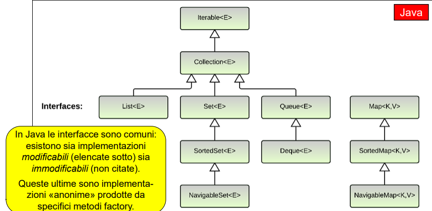
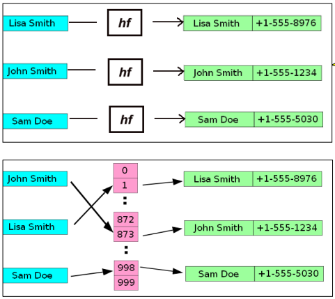
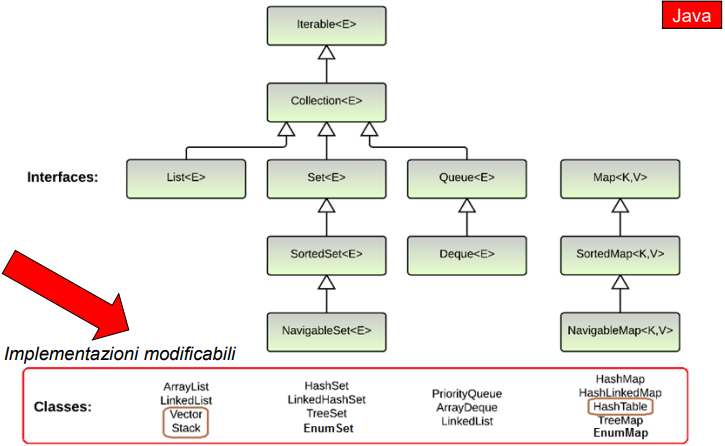

# **Strutture dati: il Collection Framework**

## 1. Cos'è un Collection Framework
Un collection framework è un'architettura logica globale e uniforme pensata per implementare le strutture dati in un linguaggio ad oggetti.

Questo framework è composto da:
- Interfacce: introducono i tipi di strutture dati in maniera ancora astratta e senza implementare nulla, insieme ad alcuni concetti di supporto necessari (es. le entità iterabili);
- Classi: prendono i concetti espressi dalle interfacce e li implementano fornendo versioni utilizzabili delle collezioni
- Librerie accessorie: contengono elementi utili nella realizzazione, come algoritmi o costanti statiche

L'organizzazione è volta a realizzare strutture **generali e parametriche**

### Similitudini e differenze tra linguaggi

Tutti i linguaggi ad oggetti offrono all'interno del loro collection framework **liste, set, mappe e iteratori**, ognuna parametrica rispetto ad un tipo generico. Gli array in questi linguaggi **NON FANNO PARTE DELLE COLLECTION**.

Varia da linguaggio a linguaggio invece la classificazione delle collezioni come **entità modificabili o immutabili**, la **restrizione dei tipi a soltanto gli oggetti** (in Java vengono esclusi i tipi primitivi), nonchè se la **parametrizzazione è limitata a compile-time** (Java, Kotlin, Scala) **o si estende anche a run-time** (C#).

Per quanto riguarda il **naming** delle classi e interfacce si è adottata questa convenzione: 

- **Nomi interfacce** --- concetti generici (Set, Map, List...)
- **Nomi classi** --- implementazioni più specifiche (TreeSet, HashMap, ArrayList...)

In Java il Collection Framework è organizzato come nel grafico sotto.


## 2. Le interfacce principali del JCF

Le interfacce chiave del Java Collection Framework sono le seguenti:
- **Collection\<T\>**: l'interfaccia genitore di Set e List, non specifica nessuna caratteristica particolare
- **Set\<T\>** (con **SortedSet\<T\>** e **NavigableSet\<T\>**): specifica un insieme di elementi (senza duplicati)
- **List\<T\>**: specifica una lista indicizzata di elementi
- **Map\<K, V\>** (con **SortedMap\<K, V\>** e **NavigableMap\<K, V\>**): specifica una tabella di associazioni chiave-valore
- **Queue\<T\>**: specifica una coda di elementi di qualsiasi tipo (FIFO, LIFO, ecc.)
- **Deque\<T\>**: specifica una coda circolare, le cui testa e coda sono collegate

L'aggettivo Sorted di SortedSet e SortedMap fa riferimento allo scorrimento della collection (per esempio nel foreach), che in questo caso implica anche l'ordinamento. L'aggettivo Navigable intende invece Set e Map navigabili in entrambi i sensi (sx - dx e viceversa).

### Iterable\<T\>

L'interfaccia Iterable è la madre di tutte le collection. Le classi che la implementano indicano la capacità di inserire loro istanze all'interno di cicli for-each per poter iterare sugli elementi contenuti. Il bisogno è nato dato che molte strutture dati non sono indicizzate come gli array, e si perdeva quindi la possibilità di scorrere gli elementi.

### Collection\<T\>

L'interfaccia Collection\<T\>, figlia di Iterable, introduce l'idea di collezione di elementi, senza ulteriori specifiche. L'interfaccia di accesso definita è altrettanto generale, composta da metodi come i seguenti:
- **add()**: aggiunge un elemento alla collezione
- **remove()**: rimuovere un elemento dalla collezione
- **contains()**: verificare se un elemento è nella collezione
- **isEmpty()**: verificare se la collezione non contiene elementi
- **toArray()**: fornire un array che contenga gli elementi della collezione
- **size()**: fornire il numero di elementi contenuti nella collezione
- **equals(that)**: verificare se due collezioni sono uguali

e altri.

### Set\<T\> e SortedSet\<T\>

Set estende Collection e introduce il concetto di insieme (senza duplicati). L'interfaccia di accesso è simile, tuttavia add() e i costruttori devono accertarsi di non inserire/avere duplicati all'interno del Set e equals adotta il significato matematico di uguaglianza insiemistica (∀x ∈ S1, x ∈ S2 e viceversa).

SortedSet estende a sua volta Set e aggiunge il concetto di ordinamento fra gli elementi, che devono necessariamente estendere Comparable\<T\> e quindi implementare compareTo() (o deve essere fornito un Comparator per poterli confrontare). Questa collection aggiunge anche i seguenti metodi:
- **first()**: restituisce il primo elemento del Set
- **last()**: restituisce l'ultimo elemento del Set
- **headSet()**: restituisce un sottoset contenente solo gli elementi minori di quello dato
- **subSet()**: restituisce un sottoset contenente gli elementi compresi tra i due dati
- **tailSet()**: restituisce un sottoset contenente gli elementi maggiori di quello dato

### List\<T\>

List anch'essa estende Collection, ma introduce il concetto di sequenza indicizzata che ammette duplicati, molto simile ad un array. La navigazione della lista avviene seguendo la sequenza di inserimento dei valori. 

Anche qua l'interfaccia di accesso è simile, tuttavia add() aggiunge un elemento in fondo alla lista, equals effettua il confronto a due a due e il nuovo metodo get(index) permettere di accedere direttamente ad una posizione della lista.

### Queue\<T\> e Deque\<T\>

Queue\<T\> introduce il concetto di coda di elementi, da cui deriva il concetto di testa della coda. Non esiste il concetto di posizione, si può solo accedere all'elemento in testa alla serie. In base al tipo di coda poi inserimenti e rimozioni saranno applicati all'inizio o alla fine della collection.

Deque\<T\> specializza ulteriormente Queue, introducendo il concetto di coda doppia e permettendo quindi di aggiungere/rimuovere elementi da entrambe le estremità.

### Map\<K, V\>

L'interfaccia Map non deriva da Collection, in quanto questa struttura è una **tabella bidimensionale** e che quindi non può derivare da una serie monodimensionale di valori.

La tabella è composta da **associazioni chiave-valore**. In altre parole ogni riga è composta da un valore associato ad un identificatore detto chiave, che è univoco. 

L'accesso ai valori non è più sequenziale, scorrendo tutti i valori della struttura, ma bensì **casuale**, **accedendo al valore direttamente tramite la sua chiave**. Questo tipo di accesso è reso possibile in due modi differenti:
- funzioni hash (HashMap): funzioni matematiche che mettono in corrispondenza chiavi e valori
- indici: si associa ad ogni chiave e il rispettivo valore un indice che facilita la ricerca

;

L'interfaccia di accesso alla collection prevede i seguenti metodi:
- **put()**: permette di inserire una nuova riga nella tabella
- **get()**: permette di accedere ad una riga specificando la chiave
- **containsKey()**: ricerca nella tabella se è presente la chiave specificata
- **containsValue()**: ricerca nella tabella se è presente il valore specificato

Esistono poi alcuni metodi che permettono di collegare le mappe alle altre strutture derivate da collection:
- **keySet()**: restituisce tutte le chiavi della mappa. Siccome le chiavi sono univoche viene restituito un Set
- **values()**: restituisce tutti i valori della mappa. Siccome i valori possono essere anche duplicati, il tipo di ritorno è Collection, in modo da non fare alcuna ipotesi
- **entrySet()**: restituisce tutte le coppie chiave-valore della tabella. Per poter essere memorizzate in un unico oggetto è stata creata l'interfaccia **Entry**, poi implementata da **AbstractMap.SimpleEntry** e **AbstractMap.SimpleImmutableEntry**, che contiene al suo interno la chiave e il valore associato.

### SortedMap\<K, V\>

Come SortedSet per Set, SortedMap estende Map e introduce il concetto dell'ordinamento delle righe tramite le chiavi, che devono implementare Comparable\<K\> (o avere fornito un Comparator per confrontarle).
Come nei Set vengono aggiunti i seguenti metodi:
- **firstKey()**: restituisce la prima chiave della mappa
- **lastKey()**: restituisce l'ultima chiave della mappa
- **headMap()**: restituisce una sottomappa ordinata contenente le chiavi minori di quella data
- **subMap()**: restituisce una sottomappa ordinata contenente le chiavi comprese tra le due date
- **tailMap()**: restituisce una sottomappa ordinata contenente le chiavi maggiori di quella data

### Libreria Collection

La libreria Collection offre alcuni metodi statici per poter operare sulle collezioni. La libreria include:
- algoritmi polimorfi per **ordinamento, ricerca binaria, ricerca min/max e riempimento** come per i metodi sort() e binarySearch(). In questo caso i metodi sono **applicabili solamente alle liste**, in quanto sono le uniche che hanno con sè il concetto di posizione, necessario per poter ordinare o cercare elementi.
- **wrapper** che permettono di **incapsulare una collezione in un'altra**.
- metodi per **ottenere collezioni vuote**, come emptyList(), emptySet(), emptyMap().

## 3. Le implementazioni delle interfacce

;

Per ogni interfaccia sono fornite più di una implementazione, tutte pensate per poter modificare il contenuto una volta inserito. Le implementazioni principali sono:
- **Set**: HashSet, TreeSet, LinkedHashSet, EnumSet
- **List**: ArrayList, LinkedList
- **Map**: HashMap, TreeMap, LinkedHashMap, EnumMap
- **Queue**: ArrayBlockingQueue, PriorityQueue, LinkedList
- **Deque**: ArrayDeque, LinkedList

Le implementazioni immutabili, per cui gli elementi inseriti non possono poi essere modificati, sono fornite tramite i metodi factory List.of(), Set.of() ecc.

## 4. Regole sull'utilizzo

### Scelta dell'implementazione corretta

Per **Set e Map**. Se si ha bisogno dell'ordinamento, utilizzare le implementazioni **TreeMap** e **TreeSet**, che implementano SortedMap e SortedSet. Se invece non si ha bisogno di ordinamento, **HashMap** e **HashSet** sono più efficienti e in quel caso consigliati. <br> Se invece serve un ordine di iterazione predicibile (voglio sapere a priori in che ordine sono gli elementi) utilizzare **LinkedHashSet** e **LinkedHashMap**, che essendo linked per ogni elemento hanno un puntatore a quello precedente e quello successivo. Se un elemento viene inserito più di una volta, la sua posizione rimane quella del primo inserimento. <br> Se le chiavi della mappa o gli elementi del set sono appartenenti ad un Enum, utilizzare **EnumSet** o **EnumMap**. Qua l'ordine di iterazione rispecchia l'ordine degli elementi nell'enum.

Per **List**. Normalmente conviene utilizzare **ArrayList** perchè realizzata su un array e con tempo di accesso costante grazie al metodo get(index). Se invece le operazioni da effettuare sono pricipalmente inserimento in testa o eliminazione di elementi al centro della lista meglio utilizzare **LinkedList**

### Costruzione

Per ogni collection sono disponibili tre costruttori:
- un **costruttore con zero argomenti** che crea una collezione vuota e modificabile
- un **costruttore per copia** che accetta come argomento un'altra collection e che ne fa la copia, anche questa modificabile
- I metodi factory **List.of, Set.of etc.** che creano una collection popolata e immutabile

Di seguito sono riportati alcuni esempi di costruzione di collezioni
```java
//Costruzione lista vuota e aggiunta valori

List<String> l1 = new LinkedList<String>(); 
l1.add("Bologna"); l1.add("Modena"); l1.add("Parma");

//Costruzione lista immutabile
List<String> l2 = List.of("Bologna", "Modena", "Parma");
```

```java
//Costruzione Set vuoti e aggiunta valori

Set<String> s1 = new HashSet<String>();
s1.add("Bologna"); s1.add("Modena"); s1.add("Parma");

Set<String> s2 = new TreeSet<String>(); //ordinato
s2.add("Piacenza"); s2.add("Ferrara"); s2.add("Rimini");

//Costruzione di Set immutabili
Set<String> s1 = Set.of("Bologna", "Modena", "Parma");

//Non esiste la factory per SortedSet si risolve in questo modo
Set<String> s2 = new TreeSet<String>(Set.of(...)); 
```

```java
//Costruzione di mappe vuote e agggiunta valori

Map<String, Integer> m1 = new HashMap<String, Integer>();
m1.add("Bologna", 395416); m1.add("Modena", 189013); m1.add("Parma", 200455);

Map<String, Integer> m2 = new TreeMap<String, Integer>();
m2.add("Bologna", 395416); m2.add("Modena", 189013); m2.add("Parma", 200455);

//Costruzione di mappe immutabili
Map<String, Integer> m1 = Map.of(
    "Bologna", 395416,
    "Modena", 189016,
    "Parma", 200455
);

//Non esiste la factory per SortedMap, si risolve in questo modo
Map<String, Integer> m2 = new TreeMap<String, Integer>(Map.of(...));
```

#### NOTA BENE: le implementazione di List, Set e Map per le costruzioni tramite metodi factory non sono le stesse di quelle per le liste modificabili.**

Inoltre, se i tipi generici degli elementi da inserire nella collection sono già stati denotati all'inizio della dichiarazione di variabile, possono essere omessi nella new sostituendoli con il **diamond operator** `<>`. Questo equivale a dire "è lo stesso tipo che ho scritto prima dell'uguale"

```java
List<String> l1 = new List<>();
Map<String, Integer> m1 = new Map<>();
```

### Vincoli delle collezioni immutabili

Nelle implementazioni delle collezioni immutabili ci sono alcune caratteristiche da tenere a mente. Le principali sono:
- I metodi **add, put e remove**, che servono per modificare una collection, **lanciano eccezione** `UnsupportedOperationException`
- Non sono accettati **elementi/chiavi null**
- Lo **scorrimento degli elementi** può **non essere nello stesso ordine** dell'inserimento
- Le **implementazioni sono value-based**, ossia **la factory sceglie se creare un nuovo oggetto o restituirne uno presente** in base ai valori presenti al suo interno. Perciò confronti come l1 == l2, che controlla se le due variabili puntano allo stesso oggetto, può dare risultati imprevedibili.

## 5. Gli iteratori

Dal grafico nella sezione 2 si può vedere come in realtà anche l'interfaccia Collection\<T\> deriva da un'altra interfaccia: **Iterable\<T\>**, che esprime un'entità sulla quale è possibile iterare tramite un ciclo for-each.<br> L'idea alla base è che ogni entità che implementa Iterable (ogni collection nel nostro caso) sa come navigare dentro se stessa. Tramite il metodo iterator() l'entità è in grado di produrre un componente, chiamato iteratore, che permette di scorrere via via tutti gli elementi al suo interno.

Il motivo per cui si usano gli iteratori e non gli indici come per gli array è perchè in molte collection il concetto di indice e in generale di sequenza non esiste. L'iteratore è la soluzione a questo problema perchè estrae un elemento alla volta dall'entità e garantisce che questo venga considerato soltanto una volta.
Di norma lo sviluppatore utilizza gli iteratori indirettamente, tramite il ciclo for-each. Tuttavia è possibile anche utilizzarlo direttamente tramite i metodi che mette a disposizione.

Un iteratore implementa sempre l'interfaccia Iterator\<T\>. Questa interfaccia definisce tre metodi:
- next(): deve fornire il prossimo elemento della sequenza
- hasNext(): deve controllare che la sequenza abbia al suo interno altri elementi o meno
- remove(): deve rimuovere dalla sequenza l'ultimo elemento restituito con next(). A differenza degli altri due questo è un metodo opzionale, inutile infatti nel caso di entità immutabili. <br> Nel caso non lo si voglia implementare basta inserire al suo interno `throw new UnsupportedOperationException()` (le classi del JCF lo hanno implementato)

Dal pezzo di codice sottostante si può vedere come funziona quindi un ciclo for-each.
```java
for(T x : collezione) {
    //operazioni su x
}

for(Iterator<T> i = collezione.iterator(); i.hasNext()) {
    //operazioni su x = i.next()
}
```

Con un iteratore quindi si può **scorrere una collezione per accedere agli elementi** e, se questa è modificabile, **modificare il contenuto degli stessi**. **NON** si può **modificare la collezione aggiungengo/togliendo elementi**, operazione che causa eccezione `ConcurrentModificationExpection`. Questa operazione infatti romperebbe sotto l'iteratore che non riesce a gestire modifiche alla struttura durante lo scorrimento.

### Iteratori e mappe

Gli iteratori navigano collezioni di elementi, contenitori **monodimensionali**. Non possono perciò essere utilizzati direttamente sulle mappe, in quanto quelle sono collezioni bidimensionali (chaive + valore). Tuttavia si può usare un iteratore per scorrere porzioni della mappa, come il Set delle chiavi generato con keySet() o la collection di valori generata con values(). Inoltre tramite entrySet(), che restituisce un Set di Entry, si può iterare sulle righe della mappa.

```java
Map<String, Integer> people = Map.of("Anna", 21, "Piero", 25, "Silvia", 43, "Guido", 56);

//scorrimento chiavi con keySet
for(String name : people.keySet()) {...}

//scorrimento valori con values
for(int age : people.values()) {...}

//righe mappa
for(Entry row : people.entrySet()) {
    System.out.println(row); //stampa nel formato chiave=valore
}
```
## 6. Conversioni fra collection

A volte può essere necessario dover **convertire una struttura dati** contenente alcuni elementi in una di altro tipo **conservando il contenuto**. A questo scopo il JCF adotta vari approcci:
- Tra i costruttori delle classi collection o i metodi factory delle versioni immutabili ne esiste uno che **prende in ingresso un'altra struttura** appoggiandosi all'interfaccia **Collection**.
- Tra i metodi delle varie collection ce ne sono vari nella forma **toSomething()** che convertono la struttura in quella specificata da Something

Entrambi i metodi **creano una nuova struttura** tramite il metodo di **copia shallow**, non duplicando quindi anche il contenuto ma **utilizzando gli stessi oggetti dell'originale**. Si hanno quindi **due strutture separate** che però **puntano agli stessi oggetti**. 

Il caso degli array è particolare e per questo separato dalle collection. La classe **Arrays** infatti fornisce **metodi statici** per **convertire un array nei vari tipi** di collection asNomeCollection(), e **ogni collection ha il metodo toArray()** che compie l'operazione inversa.

Di seguito alcuni esempi per chiarire i concetti:
```java
//Costruzione di un Set partendo da una List
List<String> l1 = List.of("Pippo", "Pluto", "Paperino", "Topolino");
Set<String> s1 = new HashSet<>(l1);

//La conversione si può fare tra collection dello stesso tipo 
// ma con diverse proprietà di modifica
List<String> l1 = List.of("Pippo", "Pluto", "Paperino", "Topolino");
List<String> l2 = new ArrayList<>(l1); //l2 è modificabile

//o dalla versione senza ordinamento a quella con (keySet ritorna un Set non un SortedSet)
SortedSet<String> keys = new TreeSet<>(map.keySet());

//Conversione da e verso array
List<String> l1 = List.of("Pippo", "Pluto", "Paperino", "Topolino");
String[] arr1 = l1.toArray(new String[0]) //l'argomento va specificato per far capire al metodo che tipo di array produrre

List<String> l2 = Arrays.asList(arr1);
```